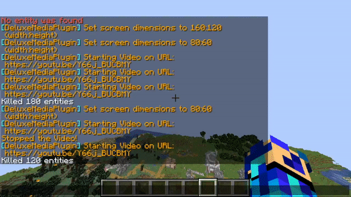

Entity Video Players
====================

Entity video players are video players which take advantage of entity
name tags to display video frames. It acts as a solid way to play media
while having the less likely-hood of timing out players.

For more information about entities, visit the following:

.. toctree::

    ../../../entity

As for summoning mobs. An in game command would be the /summon option.
However, MinecraftMediaLibrary has all the mob spawns handled for you.

Creating an Entity Callback
---------------------------

Creating an entity callback requires usage of the
`EntityCallback <https://github.com/MinecraftMediaLibrary/MinecraftMediaLibrary/blob/master/minecraftmedialibrary-api/src/main/java/com/github/pulsebeat02/minecraftmedialibrary/frame/entity/EntityCallback.java>`__
class. Creating the class requires multiple arguments. These arguments
include an instance of the library, the viewers, the entity width/height,
the delay between frames, the location at which you want to spawn the
entity, and also what type of entity you want to use.

Currently, MinecraftMediaLibrary only supports ArmorStands and
AreaEffectClouds, however, updates may change this fact. For a code
example, take a look here when we use the builder:

.. code-block:: java

  /*

  Suppose our video was resolution 640x480 pixels. This is how
  we would display it.

  setViewers(null) -> Set to null if you want everyone to see it.
  Otherwise set it to the players you want to see.

  setEntityWidth(640) -> Sets the entity width to be 640 entities.

  setEntityHeight(480) -> Sets the entity height to be 480 entities.

  setDelay(40) -> Sets the delay to be 40 milliseconds.

  setLocation(player.getLocation()) -> Sets the location of the
  screen to be the location of the player.

  setType(ScreenEntityType.AREA_EFFECT_CLOUD) -> Sets the type of
  entity to be AREA_EFFECT_CLOUD. Take a look at the enum for other
  options.

  */
  final MinecraftMediaLibrary library = ...;
  final Player player = ...;

  final EntityCloudCallback callback =
    EntityCloudCallback.builder()
      .setViewers(null)
      .setEntityWidth(640)
      .setEntityHeight(480)
      .setDelay(40)
      .setLocation(player.getLocation())
      .setType(ScreenEntityType.AREA_EFFECT_CLOUD)
      .build(library))

Once we are done creating the callback, let's create the actual
video player for entities.

Creating an Entity Video Player
-------------------------------

After creating our callback, we can use that for our video
interface. To do this, we will use the
`EntityIntegratedPlayer <https://github.com/MinecraftMediaLibrary/MinecraftMediaLibrary/blob/master/minecraftmedialibrary-api/src/main/java/com/github/pulsebeat02/minecraftmedialibrary/frame/entity/EntityIntegratedPlayer.java>`__
class. Instantiating one requires an instance of the library, the mrl (either can be
a Youtube url or a file), a callback, a location, and a width/height. For a code
example, we will use the builder:

.. code-block:: java

  final MinecraftMediaLibrary library = ...;
  final Player player = ...;

  final EntityCallback callback =
    EntityCallback.builder()
      .setViewers(null)
      .setEntityWidth(640)
      .setEntityHeight(480)
      .setDelay(40)
      .setLocation(player.getLocation())
      .setType(ScreenEntityType.AREA_EFFECT_CLOUD)
      .build(library))

  /*

  Suppose from above, the video is 640x480 pixels and we are using the player's
  location.

  setUrl("C://video.mp4") -> Sets the mrl to be the path of the video.

  setCallback(callback) -> Sets the callback for the video player.

  setWidth(640) -> Sets the width to be 640 pixels.

  setHeight(480) -> Sets the height to be 480 pixels.

  */
  final EntityIntegratedPlayer player =
    EntityIntegratedPlayer.builder()
          .setUrl("C://video.mp4")
          .setCallback(callback)
          .setWidth(640)
          .setHeight(480)
          .build(library);

After that, we are done! Call the proper control methods on the
video player to play, pause, or release.
