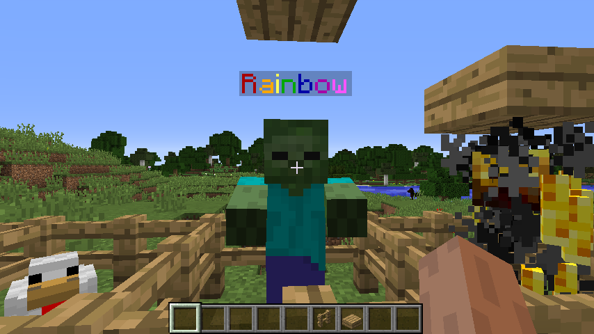

Entity Nametags in a Nutshell
=============================

While map pixels are limited to around 100 colors, entity nametags in
Minecraft can have any possible RGB color available (at least of
Minecraft 1.16.X). While this may seem that it would have a better
quality compared to map pixels/dithering, it actually isn't.

Usage of Entities
-----------------

You would spawn one single entity per pixel in the height of the
video player. Then, you would have extremely long names for them
for the colors. You would update each row's color based on the pixels
that the video frame delivers.

The entity used doesn't matter at all. You could particles, armorstands,
or even pigs. However, in general you would use particles or armorstands
as it is easy to make them invisible to the player (instead of applying
the invisibility potion effect to some other entity like a cow).

Downsides of Entities
---------------------

While the benefit of entities are that they don't occupy map slots,
they can be controlled easily, their quality often lacks. RGB may
seem nice, but due to limitations in packets, the quality the client
receives is usually nowhere as close compared to actual maps. The reason
due to this is because Map packets are able to be compressed and send
more information to clients (each pixel by pixel) compared to entities.
In fact, I believe the colors are stored in some sort of ByteBuffer in
the NMS code.

However, entities still provide a solid way of video playback. They are
pretty good for playing low resolution videos, and unlike map packets,
will have a less likely hood of timing out the player from the size of
the packets.

Performing the Impossible
-------------------------

There is actually a way to play a video using map packets without allowing
the watchers to time out (at large resolutions). This hack will also allow
an entity screen to be higher. Theoretically, it is possible that if you
cancel all unnecessary packets not related to the current video playback, the
watcher will be able to have more bandwidth to accept packets to watch the
video. While making sure the packets are limited correctly, we could remove
move packets, entity packets, etc, and allow for more space for the map packets
or entity packets (or whatever packets we intend to send). While this is a great
idea to support large resolution players, it is very hacky, and by my decision
not worth implementing (as it will likely break a lot of mechanics). However, if
you manage to get something working, feel free to contact me and I can try and 
see how I could use that inside the library.
