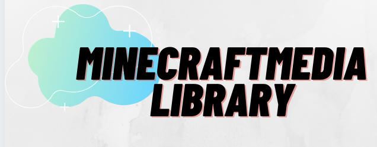

MinecraftMediaLibrary
=====================

**MinecraftMediaLibrary** is a library used to display media to players
such as pictures, audio, videos, and other forms of media. It uses
a variety of displays that are customizable depending on the user's
needs.

Importing MinecraftMediaLibrary Into a Project
----------------------------------------------

First, add `Jitpack <https://jitpack.io/>`__ because the repository is hosted there.

.. tabs::

   .. group-tab:: Maven

      .. code:: xml

        <repository>
           <id>jitpack.io</id>
           <url>https://jitpack.io</url>
        </repository>

   .. group-tab:: Gradle (Groovy)

      .. code:: groovy

         repositories {
            maven { url 'https://jitpack.io' }
         }

   .. group-tab:: Gradle (Kotlin)

      .. code:: kotlin

  		   repositories {
  		      maven { url ("https://jitpack.io") }
  		   }

Then, add the actual library repo itself.

.. tabs::

  .. group-tab:: Maven

     .. code:: xml

        <dependency>
           <groupId>com.github.minecraftmedialibrary</groupId>
           <artifactId>minecraftmedialibrary</artifactId>
           <version>master-SNAPSHOT</version>
        </dependency>

  .. group-tab:: Gradle (Groovy)

     .. code:: groovy

        dependencies {
           implementation 'com.github.minecraftmedialibrary:minecraftmedialibrary:-SNAPSHOT'
        }

  .. group-tab:: Gradle (Kotlin)

     .. code:: kotlin

        dependencies {
           implementation("com.github.minecraftmedialibrary:minecraftmedialibrary:-SNAPSHOT")
        }

Links to Sections
-----------------

.. toctree::

    history
    map
    entity
    vlc/vlc
    code/youtube/youtube-extraction
    code/video/video-player

Indices and Tables
------------------

* :ref:`genindex`
* :ref:`search`
