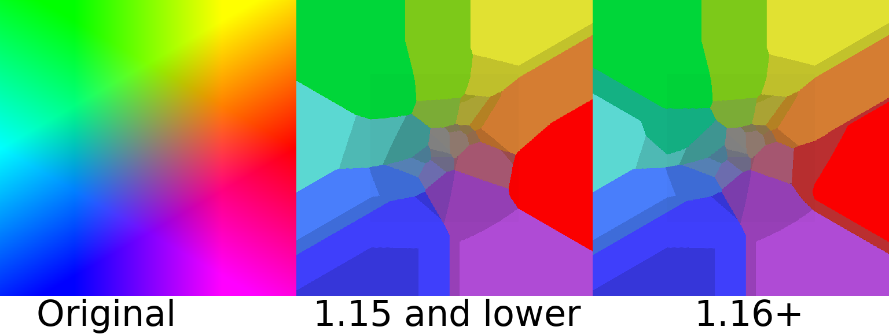

Minecraft Maps in a Nutshell
============================

When Minecraft uses maps (either from creating a new map in your world,
another plugin, or other causes), it occupies a specific ID. This ID is
unique for the map and stores information about the graphics of the map.

Map IDs are stored by a data type and have limited IDs available.

.. note::
  For versions 1.13 and above, the map ID increased greatly. For versions
  that are below 1.13, the maximum map ID is 32767. Otherwise, the maximum
  is around 4 billion possible ids (counting negative and positive). Make
  sure to research about this!

Displaying Pixels on Maps
-------------------------

A Minecraft map is composed of 128x128 pixels. This means that there are
128 * 128 possible pixels to display or 16,384 pixels. If we combine multiple
of these maps together, we are able to simulate an actual video player from
the pixels. However, there is a catch.

Minecraft Map Palette
---------------------

The Minecraft map palette is limited to only a little bit more than 100 possible
colors. Take a look at this infographic for more information on what I mean.

That means that we have to find a way to convert all possible RGB colors that our
video may make (which is 256 * 256 * 256 or 16,777,216 possible colors). We need to
find a way to downscale nearly 17 million colors to 100. How can we do this?

The Power of Dithering
----------------------

To solve the given issue above, we can use an algorithm called
`dithering <https://en.wikipedia.org/wiki/Dither>`__. You may have heard this in audio
where you dither certain sound frequencies. A similar concept is used on images.

Dithering comes in many forms. There is
`Ordered Dithering <https://en.wikipedia.org/wiki/Ordered_dithering>`__ which uses a
matrix to dither each pixel of an image, but there is also
`error diffusion dithering <https://en.wikipedia.org/wiki/Error_diffusion>`__ which
doesn't use a matrix but rather uses the colors of surrounding neighbors to define
its own color. This results in a better overall quality of image, but at the cost
of slower speed.

In EzMediaCore, it supports Standard Downscaled Dithering, Ordered Dithering,
Filter Lite Dithering, and Floyd Steinberg Dithering. Implementation of various
dithering algorithms can be found within the dither package.

Speed and Quality of Dithering Algorithms
-----------------------------------------

- Ordered Dithering
  - Very fast
  - Produces a decent quality image

- Floyd Steinberg Dithering
  - Bit slower compared to Ordered Dithering
  - Produces best quality image possible

- Filter Lite Dithering
  - Bit faster compared to Floyd Steinberg Dithering
  - Produces best quality image possible (but a little bit darker)

- Standard Dithering
  - Fastest out of all
  - Produces poor quality image

If you need help or information about anything that you are confused about, feel
free to contact me.
